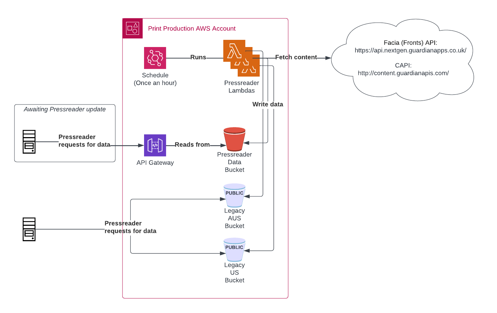

# Documentation

This folder contains documentation relating to the Birthdays service, including
Architecture Decision Records (ADRs), and other context associated with this project.

## ADRs

- [What is an ADR?](https://adr.github.io/)
- [ADRs for this project](./adr)

## Infrastructure

This project runs in AWS and is described using the [Guardian CDK](https://github.com/guardian/cdk) 
which is extended from the [AWS Cloud Development Kit (CDK)](https://aws.amazon.com/cdk/) project.

### AWS Architecture

[LucidChart Link](https://lucid.app/lucidchart/4040f7d6-661a-4867-ade0-93ca657a5580/edit?viewport_loc=-103%2C-73%2C1859%2C946%2C0_0&invitationId=inv_0cb12b70-eb29-4a54-8838-b4d32e07d820)

## Configuration

The Pressreader lambdas configuration is in the [Pressreader GitHub repository](https://github.com/guardian/pressreader/tree/main/packages/pressreader/src/editionConfigs), and configuration changes are rolled out by creating a PR for changes, merging that PR and having the changes by released by continuous delivery.

There is further documentation on [how the configuration affects what is published](./pressreader-config.md).

## Logs & Monitoring

Lambda logs can be viewed using the [`app: pressreader` filter in Kibana on logs.gutools.co.uk](https://logs.gutools.co.uk/s/newsroom-resilience/goto/8f38a860-fb94-11ed-a6e5-05ce52e0b77b).

Monitoring on lambda errors is configured in [`./cdk/lib/pressreader.ts`](../packages/cdk/lib/pressreader.ts#L141), and will send alarm events to `newsroom.resilience+alerts@guardian.co.uk`.