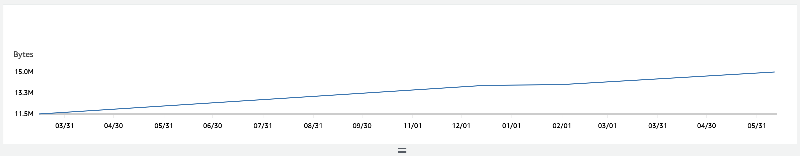

# Keeping old objects & storage costs

## Context

This service stores data in AWS S3 and has no mechanism to clean-up old objects and as such presents a possible increasing cost over time as we [pay for the amount of data](https://aws.amazon.com/s3/pricing/) we store over time.

## Options

### S3 Object Expiration

We could choose to use [S3 object expiration](https://docs.aws.amazon.com/AmazonS3/latest/userguide/lifecycle-expire-general-considerations.html) to remove old objects over time.

## Cost Estimate

Looking at the current rate of increasing storage for the current AUS bucket we see that we accumulate very little data over time:

3.5M over 4 years is a very low rate of accumulation and also a very low storage volume. Storage costs in S3 at time of writing (June 2023), are $0.023 per GB per month.

## Decision

At the expected rate of storage use increase and the associated AWS costs for monthly storage, it is not worth our time to properly specify & implement object expiry.
